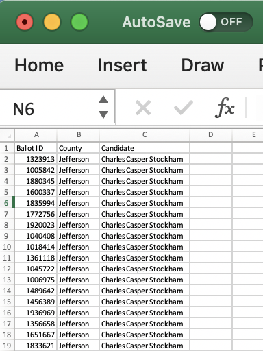
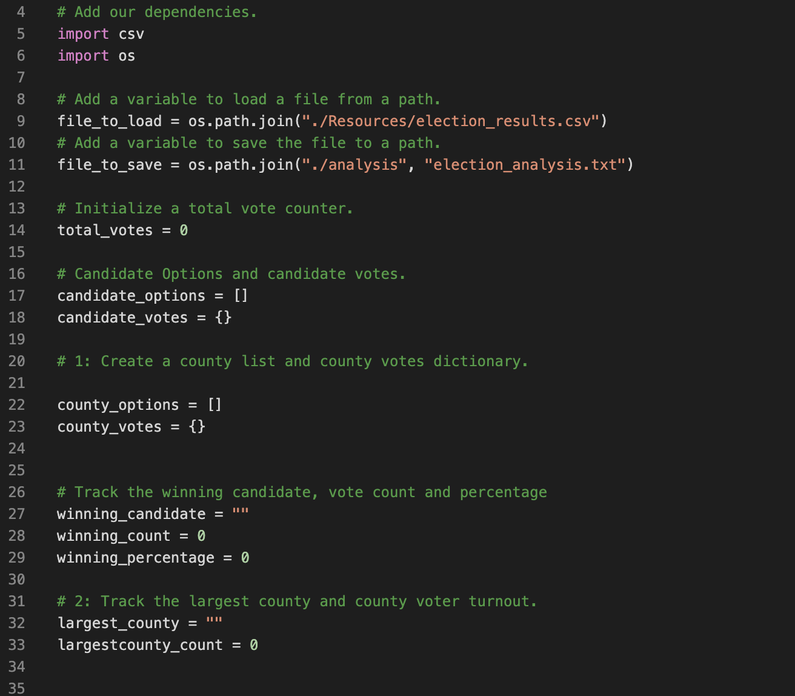
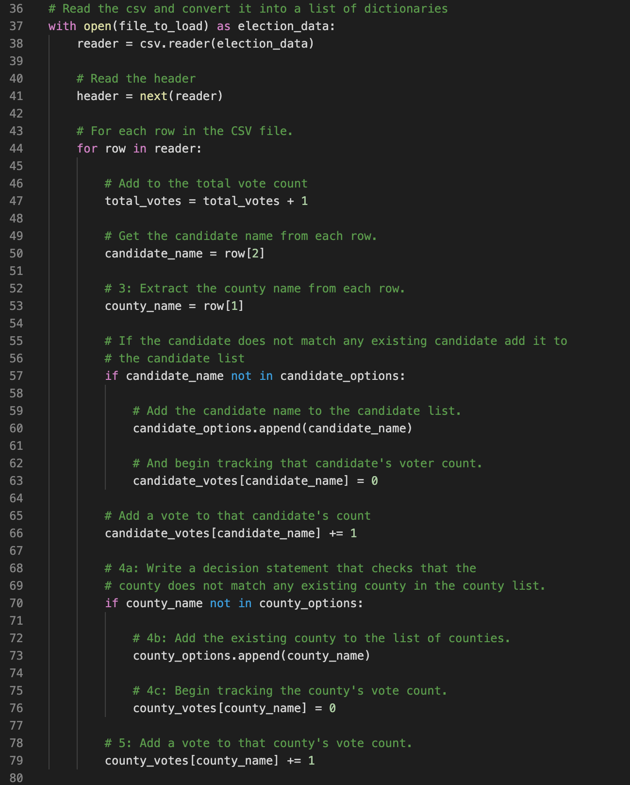
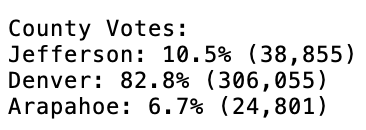
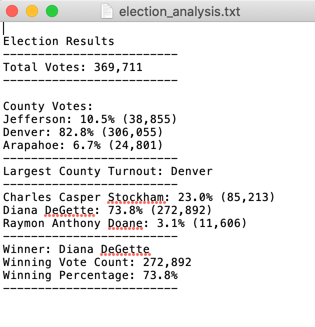

# Election Audit Analysis Project

## Overview of the Election Audit
An employee of the Colorado Board of Elections has asked us to complete the following tasks to finalize and analyize the election audit of a recent congressional election:

* Calculate the total number of votes cast
* Get a complete list of candidates who received votes
* Calculate the total number of votes each candidate received
* Calculate the percentage of votes each candidate won
* Determine the winner of the election based on popular vote
* The voter turnout for each county
* The percentage of votes from each county out of the total count
* The county with the highest turnout

We used a dataset of election data provided to us by the Colorado Board of Elections and wrote Python scripts to analyze the data and find answers to the Board's questions. We first started with code that analyzes the data to find information about the election in general, we tabulate the results of the election, find the winner and then, for the next part of our project we added code to analyze voter turnout, across the counties included in the dataset. The code we wrote outputs the results of our audit and analysis to the computer's Terminal as well as to a text file, which can be used by the Board to analyze and audit other elections.

**Sample of election retults dataset provided in .csv format:**

## Resources
Data source provided:  election_results.csv
Software utilized: 

* Python Version 3.8.3 
* Visual Studio Code Version: 1.47.3

## Election-Audit Results
Using the Python3 programming language and a code editor called VS Code, we wrote code that opens and accesses the provided data and uses lists and dictionaries to tabulate data about the votes each candidate and each county had. 
The code uses'for' loops and conditional statements to run through the entire dataset, and assign the proper counts to each candidate and county. The code also calculates the percentage of total for both candidate voers and the votes cast in each countty and outputs the results both to the computer's 'Terminal' and a text file. 

Results of the analysis follow:
* The recent Colorado congressional election had a total of 369,711 votes cast

* The votes cast in this election were from 3 different counties in the electoral precint, we calculated the number of votes and percentage of the total votes cast by county
   * Jefferson county had 10.5% of the total, with 38,855 votes cast
   * Denver county had 82.8% of the total, with 306,055 votes cast
   * Arapahoe county had 6.7% of the total, with 24,801 votes cast

**Our output for the vote breakdown by county rendered as follows:**

* Denver county had the largest number of votes cast (306,055) among the 3 counties in the precinct we analyzed, representing 82.8% of all the votes cast

* The breakdown of the number of votes and the percentage of the total votes each candidate received is:
      * Charles Casper Stockham received 85,213 votes, which is 23.0% of the total votes cast
      * Diana DeGette received 272,892 votes, which is 73.8% of the total votes cast
      * Raymon Anthony Doane received 11,606 votes, which is 3.1% of the total votes cast

* The winner of the election based on popular vote was: Diana DeGette, who received 272,892 votes, which was 73.8% of all the votes cast in this election.

**The output file we created, contains answers to the questions the Colorado Board of Elections was interested in seeing:**

## Election Audit Summary
The analysis of the election data determines the winner of the election, as well as breaking down the votes received by each candidate and calculates the percentage of the total votes cast. This analysis also looks at voter turnout in each of the the 3 counties in the precint that was analyzed. The code written for this analysis can be used with to analyze and audit other elections, and since this code is written using the very versatile Python language, it can be modified to look at additional data as well as different datasets and extract valuable insights.
The only constraints would be that easy adaptation to other analyses would be easier with an input dataset   in the same or a similar layout as the one we used to build the code- and include a ballot number or identifier, the county in which that vote was cast and the candidate the vote was cast for. The same code can be modified for small differences in how a dataset may be structured. This code could be used to analyze all of the elections for different offices as well as more or all precints in a state and could be modified to produce breakouts of voter turnout by precint and even by other geographical areas- if there is additional data provided on these areas (such as zip codes or cities). To modify the code, the additional data on additional precints or additional geographical parameters would first have be looked at to determine its structure, and then additional code blocks with iteration loops and conditional statements, similar to those employed in this code would be added, as appropriate. 
